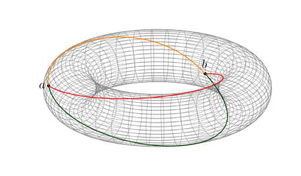

Compiled example
----------------


Currently, this one is not working, because of this error:

```
/usr/local/texlive/2013/texmf-dist/asymptote/three.asy:
2906.13: runtime: to support onscreen rendering, please install glut library, run ./configure, and recompile
```

Credits
-------

This graph was created by [Charles Staats](http://tex.stackexchange.com/users/484/charles-staats) ([source](http://tex.stackexchange.com/a/149991/5645))
