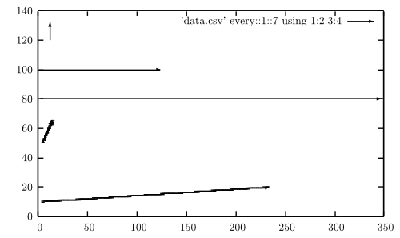

GnuPlot and CSV-Files
=====================

Syntax: `plot 'data.csv' every::1::7  using 1:2 with boxes`

* `data.csv`: The CSV-file
* `every::1::7`: use data from line 1 to line 7
* `using 1:2`: use first and second column
* `with boxes`: can also be `lines` or `vectors head size 0.1,20,60 filled lc palette`

Examples
--------
* http://www.gnuplotting.org/tag/data/
