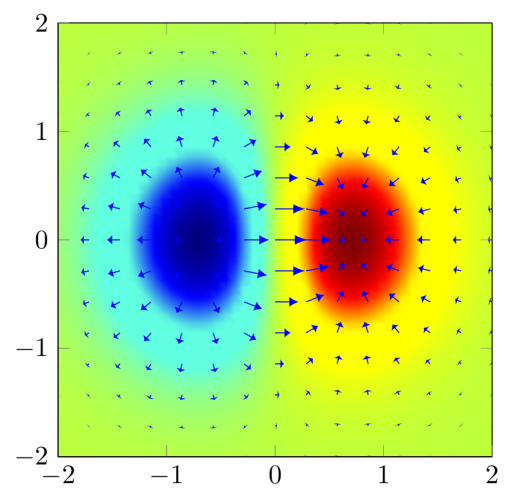

Compiled example
----------------

Creation
--------
* Make sure that `gnuplot` is installed and in your PATH.
* You can let Wolfram|Alpha calculate you gradients (http://www.wolframalpha.com/input/?i=gradient+of+x%2F%28e%5E%28x%5E2%2By%5E2%29%29)
* See http://en.wikibooks.org/wiki/LaTeX/Colors for colors