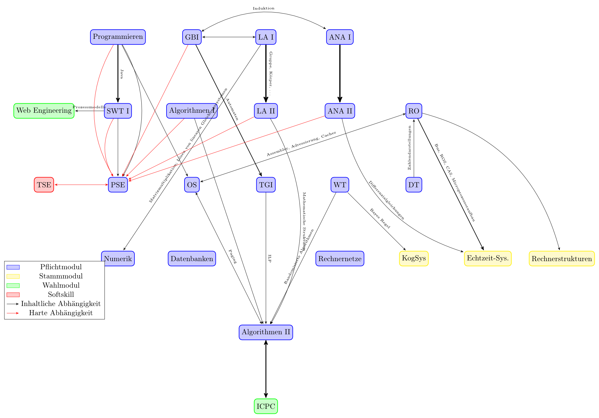

Der hier abgebildete Graph gibt Abhängigkeiten an, wie ich sie wahrnehme.

## Empfehlungen und Kommentare

* Will man Caches verstehen, sollte man die TI-Klausuren rechnen. Weder die OS-Folien, noch die TI-Folien erklären sie so gut wie die TI-KLausuren.
* Die OS zu Algorithmen 2 Abhängigkeit ist bei Prautzsch ist das nicht mehr vorhanden.
* Ana -> Numerik (Newton-Verfahren, DGLs)
* Algo I -> Datenbanken (Indizes)
* TGI -> Rechnernetze (Codierung, eventuell Krypto)
* LA II -> KogSys (Affine Transformationen)
* Ana/HM -> KogSys (Fouriertransformation)

## Abkürzeungen

* ANA: Analysis (bzw. HM)
* DT: Digitaltechnik
* GBI: Grundbegriffe der Informatik
* LA: Lineare Algebra
* KogSys: Kognitive Systeme
* OS: Betriebssysteme
* PSE: Praxis der Software-Entwicklung
* RO: Rechnerorganisation
* SWT: Softwaretechnik
* TGI: Theoretische Grundlagen der Informatik
* TSE: Teamarbeit in der Software-Entwicklung
* WT: Wahrscheinlichkeitstheorie

## Master

* Mustererkennung, Neuronale Netze, Machine Learning 1, Machine Learning 2